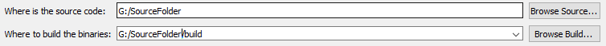
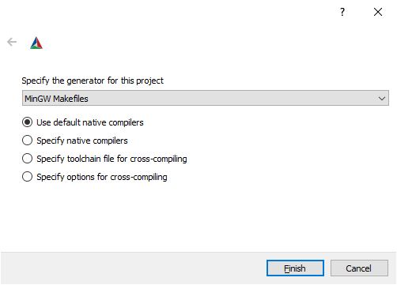

# Ray-Tracing-Project
A Ray Tracer created for my final project at University.

## CMake Instructions
### Required Software
To compile and run the program on Windows, the following software is required:
* MinGW32 GCC C++
* MinGW32-Make
* CMake Ver 3.15 or Higher

### Using CMake
1. Set the source directory to the directory containing the **CMakeLists.txt** file.

2. Click *Configure* and select *MinGW Makefile* in the drop list.

3. Once finished several variables will appear, the only one required to change is **CMAKE_INSTALL_PREFIX**.
Set this to the location you wish to install the software.
4. Click *Configure* to set the variables.
5. Click *Generate* to create a **makefile** in the *build* directory
6. Open a **Command Prompt** or **Powershell** window, and navigate to the *build* directory
7. Run ``mingw32-make install``
8. The software will now be ready to run from the *install* directory
